

  

## 📑 Índice
- [1. Sobre o Projeto](#1-sobre)
- [2. Pesquisa de Mercado](#2-mercado)
- [3. Planejamento](3#-planejamento)
- [4. Funcionalidades da Aplicação](#4-funcionalidades)
- [5. As Histórias de Usuário](#5-historias)
- [6. Layout](#6-layout)
- [7. Teste de usabilidade](7#-teste)
- [8. Objetivos de Aprendizagem](7#-aprendizagem)
- [9. Autoras](#8-autoras)

## 🌍 1. SOBRE O PROJETO
O projeto **BURGUER QUEEN** foi criado no bootcamp da [Laboratoria Brasil](https://www.laboratoria.la/br). 

O desafio foi desenvolver uma aplicação destinada aos funcionários de uma hamburgueria. 
Para isso, criou-se uma aplicação SPA (_Single Page Aplication_), uma interface web integrada com a API [Burger Queen API](https://https://lab-api-bq.herokuapp.com/api-docs/), usando  JavaScript (ES6 +), HTML, CSS e o framework React. 
Além disso, a interface é responsiva.  

A aplicação foi denominada "Hamburgueria Jesus" e atende às necessidades dos funcionários que trabalham no atendimento dos clientes e no gerenciamento do preparo dos pedidos.

## 💡 2. PESQUISA DE MERCADO
O squad visitou uma unidade de uma rede de fastfood, onde foi possível indentificar as necessidades comuns dos funcionários, como, por exemplo, visualizar comandas diferentes em uma única página e apagar a anotação de pedido após um erro. Essa experiência foi útil pois influenciou as escolhas das páginas e funcionalidades implementadas.

## 📚 3. PLANEJAMENTO
Para o planejamento, respeitamos o método "FDP" (Fatiar, Descartar e Priorizar) e utilizamos a ferramenta GitHub Projects.
A implementação das funcionalidades foi segmentada conforme as histórias de usuários de diferentes sprints.
(foto do planning)

## 💡 4. FUNCIONALIDADES DA APLICAÇÃO 
Na aplicação tem funcionalidades específicas para 3 tipos de funcionários. Sendo eles o garçom/garçonete, cozinheiro(a) e o(a) gerente.

O garçom/garçonete tem acesso ao "Cardápio", onde consegue visualizar os menus, e ao "Atendimento", onde consegue ver os status das mesas, anotar pedido e o histórico de pedidos prontos e entregues.

O cozinheiro(a) tem acesso a "Pedidos", onde consegue ver e manipular o status dos pedidos e o histórico de pedidos prontos e entregues.

O(a) gerente tem acesso a todas as funcionalidades.

## 📚 5. AS HISTÓRIAS DE USUÁRIO
As funcionalidades foram implementadas conforme cada história do usuário

**[Historia de usuário 1]** 
"Eu, como funcionária quero entrar no sistema de pedidos".
A funcionária deve:
- [x] Acessar uma tela de login.
- [x] Inserir email e senha.
- [x] Receber mensagens de erros compreensíveis, conforme o erro e as informações inseridas.
- [x] Entrar no sistema de pedidos caso as credenciais forem corretas.

**[Historia de usuário 2]** 
"Eu como garçom/garçonete quero poder anotar o pedido de um cliente para não depender da minha memória, saber quanto cobrar e poder enviar os pedidos para a cozinha para serem preparados em ordem".
A atendente deve:
- [x] Acessar uma página específica para anotar pedidos.
- [x] Anotar o nome do cliente.
- [x] Adicionar produtos aos pedidos.
- [x] Excluir produtos.
- [x] Ver resumo e o total da compra.
- [x] Enviar o pedido para a cozinha (guardar em algum banco de dados).
- [x] Funcionar bem em um tablet.

**[Historia de usuário 3]** 
"Eu como chefe de cozinha quero ver os pedidos dos clientes em ordem, poder marcar que estão prontos e poder notificar os garçons/garçonetes que o pedido está pronto para ser entregue ao cliente".
A cozinheira deve:
- [x] Ver os pedidos ordenados à medida em que são feitos.
- [x] Marcar os pedidos que foram preparados e estão prontos para serem servidos..
- [x] Ver o tempo que levou para preparar o pedido desde que chegou, até ser marcado como concluído.

**[Historia de usuário 4]** 
"Eu como garçom/garçonete quero ver os pedidos que estão prontos para entregá-los rapidamente aos clientes".
A atendente deve:
- [x] Ver a lista de pedidos prontos para servir.
- [x] Marcar os pedidos que foram entregues.

### 🎨 6. LAYOUT
As cores do layout foram pensadas de acordo com as cores de um hamburguer.
### Telas:

  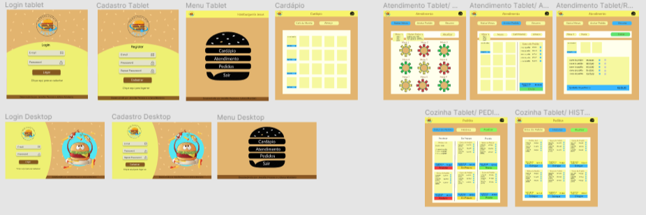

Fizemos um fluxograma para verificar quais seriam os passos do usuários de acordo com cada histórias de usuário.
### Fluxograma:

## 🎯 Protótipos:
Os protótipos foram pensandos na experiência dos usuários e para visualizar a melhor forma de montar a aplicação.
### Protótipos em alta fidelidade para Tablet:
Tela de Login e Cadastro:

  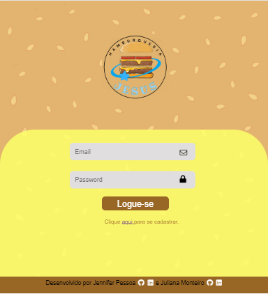
  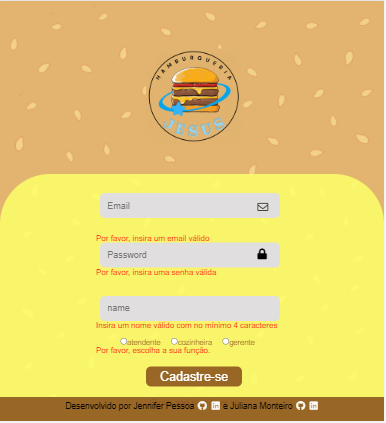

Home:

  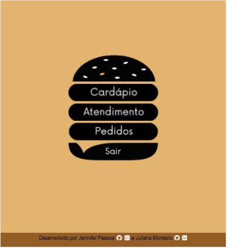

Tela de Cardápio:

  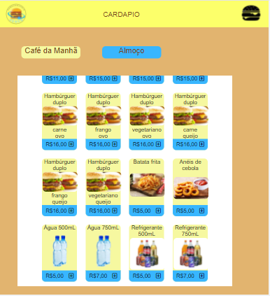

Tela de Atendimento:

  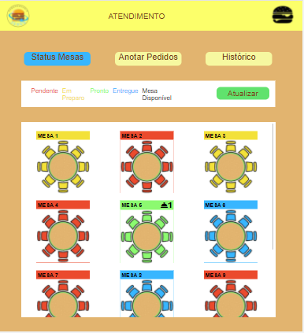
  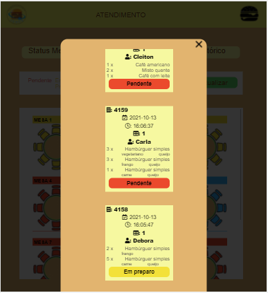
  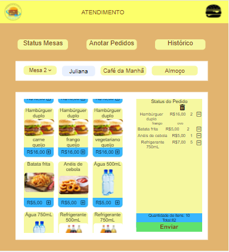
  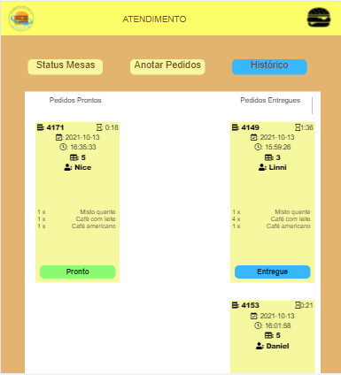

Tela de Pedidos:
Tela de Atendimento:

  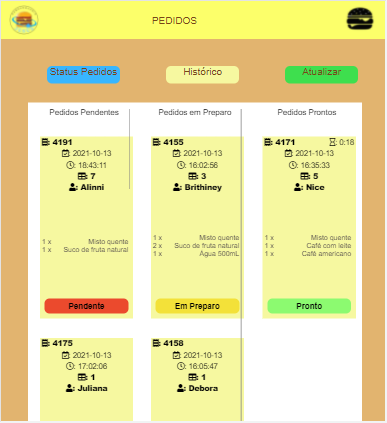
  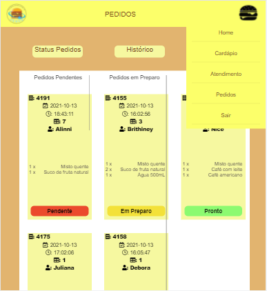

## 💺 7. TESTE DE USABILIDADE - experiência do usuário 
Utilizamos o **FORMS** para criar um formulário [formulário](https://forms.gle/qbwDEFsvP2wtyAft7), em que questionamos quais foram as experiências dos usuários, ao usar cada funcionalidade, e como foi o desempenho da aplicação.

Após a coleta das respostas, filtramos sugestões de melhoria, e uma delas já foi implementada.
Um usuário sugeriu que alterássemos o formato do botão para que o "click" ficasse mais intuitivo, e isso foi implementado.

Botão inicial: 

  

Botão após teste de usabilidade: 

  

## 📚 8. OBJETIVOS DE APRENDIZAGEM

HTML
- [x] Uso de HTML semântico

CSS
- [x] Uso de seletores de CSS
- [x] Empregar o modelo de caixa (box model): borda, margem, preenchimento
- [x] Uso de flexbox en CSS
- [x] Uso de media queries

JavaScript
- [x] Uso ES modules
- [x] Uso de linter (ESLINT)
- [x] Uso de identificadores descritivos (Nomenclatura | Semântica)

Git e GitHub
- [x] Git: Instalação e configuração
- [x] Git: Controle de versão com git (init, clone, add, commit, status, push, pull, remote)
- [x] Git: Integração de mudanças entre ramos (branch, checkout, fetch, merge, reset, rebase, tag)
- [x] GitHub: Criação de contas e repositórios
- [x] GitHub: Colaboração pelo Github (branches | forks | pull requests | code review | tags)
- [x] GitHub: Organização pelo Github (projects | issues | labels | milestones | releases)

HTTP
- [x] Solicitações o requisições (request) e respostas (response).
- [x] Cabeçalhos (headers)
- [x] Corpo (body)
- [x] Verbos HTTP
- [x] Codigos de status de HTTP
- [x] Encodings e JSON
- [x] CORS (Cross-Origin Resource Sharing)

react
- [x] jsx
- [x] components
- [x] events
- [x] lists-and-keys
- [x] conditional-rendering
- [x] lifting-up-state
- [x] hooks
- [x] routing

UX (User eXperience)
- [x] Desenhar a aplicação pensando e entendendo o usuário
- [x] Criar protótipos para obter feedback e iterar
- [x] Aplicar os princípios de desenho visual (contraste, alinhamento, hierarquia)
- [x] Planejar e executar testes de usabilidade

## 👩‍💻 9. AUTORAS:
Projeto realizado para o Bootcamp da **LABORATÓRIA.**
<h2 >
<a style="color:aqua" href="https://github.com/jenniferpessoa" target="_blank">Jennifer Pessoa</a> e 
<a style="color:aqua" href="https://github.com/JulianaMonteiro4">Juliana Monteiro</a></h2>
