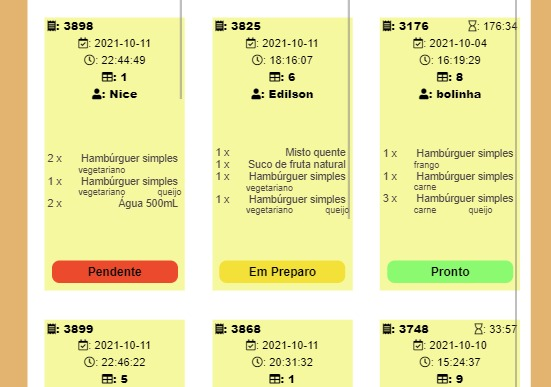

## 📑 Índice
- [1. Sobre o Projeto](#1-sobre)
- [2. Pesquisa de Mercado](#2-mercado)
- [3. Planejamento](3#-planejamento)
- [4. As Histórias de Usuário](#6-objetivos)
- [5. Funcionalidades da Aplicação](#4-funcionalidades)
- [6. Layout](#5-layout)
- [7. Teste de usabilidade](7#-teste)
- [8. Teste de usabilidade](7#-teste)
- [9. Autoras](#8-autoras)

## 🌍 1. SOBRE O PROJETO
O projeto **BURGUER QUEEN** foi criado no bootcamp da [Laboratoria Brasil](https://www.laboratoria.la/br). 

O desafio foi desenvolver uma aplicação destinada aos funcionários de uma hamburgueria. 
Para isso, criou-se uma aplicação SPA (_Single Page Aplication_), uma interface web integrada com a API [Burger Queen API](https://https://lab-api-bq.herokuapp.com/api-docs/), usando  JavaScript (ES6 +), HTML, CSS e o framework React. 
Além disso, a interface é responsiva.  

A aplicação foi denominada "Hamburgueria Jesus" e atende às necessidades dos funcionários que trabalham no atendimento dos clientes e no gerenciamento do preparo dos pedidos.

## 💡 2. PESQUISA DE MERCADO
O squad visitou uma unidade de uma rede de fastfood, onde foi possível indentificar as necessidades comuns dos funcionários, como, por exemplo, visualizar comandas diferentes em uma única página e apagar a anotação de pedido após um erro. Essa experiência foi útil pois influenciou as escolhas das páginas e funcionalidades implementadas.

## 📚 3. PLANEJAMENTO
Para o planejamento, respeitamos o método "FDP" (Fatiar, Descartar e Priorizar) e utilizamos a ferramenta GitHub Projects.
A implementação das funcionalidades foi segmentada conforme as histórias de usuários de diferentes sprints.
(foto do planning)

## 📚 4. AS HISTÓRIAS DE USUÁRIOS

## 💡 5. FUNCIONALIDADES DA APLICAÇÃO 
Na aplicação tem funcionalidades específicas para 3 tipos de funcionários. Sendo eles o garçom/garçonete, cozinheiro(a) e o(a) gerente.

O garçom/garçonete tem acesso ao "Cardápio", onde consegue visualizar os menus, e ao "Atendimento", onde consegue ver os status das mesas, anotar pedido e o histórico de pedidos prontos e entregues.

O cozinheiro(a) tem acesso a "Pedidos", onde consegue ver e manipular o status dos pedidos e o histórico de pedidos prontos e entregues.

O(a) gerente tem acesso a todas as funcionalidades.

### 🎨 6. LAYOUT
As cores do layout foram pensadas de acordo com as cores de um hamburguer.
### :

Fizemos um fluxograma para verificar quais seriam os passos do usuários de acordo com cada histórias de usuário.
### Fluxograma:
<h1>
  
</h1>

## 🎯 Protótipos:
Os protótipos foram pensandos na experiência dos usuários e para visualizar a melhor forma de montar a aplicação.
### Protótipos em alta fidelidade para Tablet:
<h1>
  
</h1>

## 💺 7. TESTE DE USABILIDADE - experiência do usuário 
Utilizamos o **FORMS** para criar um formulário onde questionamos quais foram suas experiências detalhadas sobre cada funcionalidade, e como foi o desempenho da aplicação.

https://forms.gle/qbwDEFsvP2wtyAft7

Após a coleta das respostas, filtramos sugestões de melhoria, e uma delas já foi implementada.
Um usuário sugeriu que alterássemos o formato do botão para que o "click" ficasse mais intuitivo, e isso foi implementado.

Botão inicial: 

  

Botão após teste de usabilidade: 

  

## 📚 8. OBJETIVOS DE APRENDIZAGEM

HTML
- [x] Uso de HTML semântico

CSS
- [x] Uso de seletores de CSS
- [x] Empregar o modelo de caixa (box model): borda, margem, preenchimento
- [x] Uso de flexbox en CSS
- [x] Uso de CSS Grid Layout
- [x] Uso de media queries

JavaScript
- [x] Testes unitários
- [x] Testes assíncronos
- [x] Mocking
- [x] Uso ES modules
- [x] Uso de linter (ESLINT)
- [x] Uso de identificadores descritivos (Nomenclatura | Semântica)

Git e GitHub
- [x] Git: Instalação e configuração
- [x] Git: Controle de versão com git (init, clone, add, commit, status, push, pull, remote)
- [x] Git: Integração de mudanças entre ramos (branch, checkout, fetch, merge, reset, rebase, tag)
- [x] GitHub: Criação de contas e repositórios, configuração de chave SSH
- [x] GitHub: Implantação com GitHub Pages
- [x] GitHub: Colaboração pelo Github (branches | forks | pull requests | code review | tags)
- [x] GitHub: Organização pelo Github (projects | issues | labels | milestones | releases)

HTTP
- [x] Solicitações o requisições (request) e respostas (response).
- [x] Cabeçalhos (headers)
- [x] Corpo (body)
- [x] Verbos HTTP
- [x] Codigos de status de HTTP
- [x] Encodings e JSON
- [x] CORS (Cross-Origin Resource Sharing)

react
- [x] jsx
- [x] components
- [x] events
- [x] lists-and-keys
- [x] conditional-rendering
- [x] lifting-up-state
- [x] hooks
- [x] css-modules
- [x] routing

UX (User eXperience)
- [x] Desenhar a aplicação pensando e entendendo o usuário
- [x] Criar protótipos para obter feedback e iterar
- [x] Aplicar os princípios de desenho visual (contraste, alinhamento, hierarquia)
- [x] Planejar e executar testes de usabilidade

## 👩‍💻 9. AUTORAS:
Projeto realizado para o Bootcamp da **LABORATÓRIA.**
<h2 >
<a style="color:aqua" href="https://github.com/jenniferpessoa" target="_blank">Jennifer Pessoa</a> e 
<a style="color:aqua" href="https://github.com/JulianaMonteiro4">Juliana Monteiro</a></h2>
